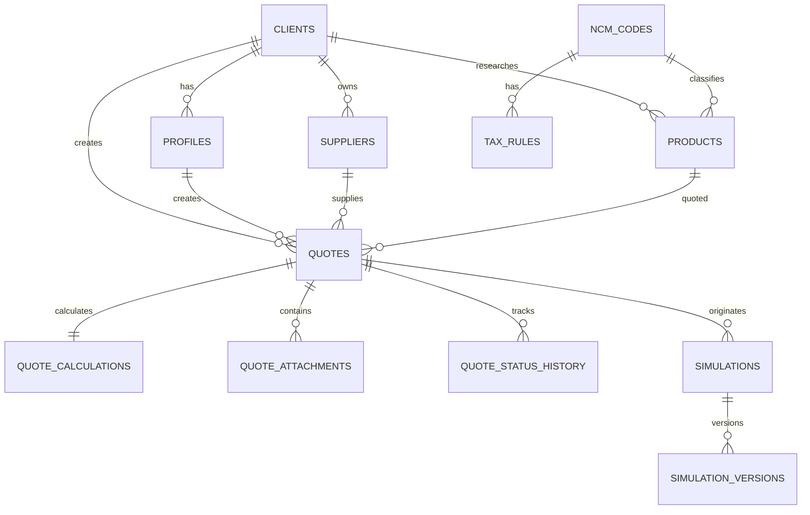

# Global RPX - Modelo Inicial de Banco

## Convencoes

- Banco: Supabase Postgres.
- IDs: `uuid` com `gen_random_uuid()`.
- Datas: `timestamptz`.
- Valores monetarios e taxas: `numeric`, nunca `float`.
- Dados de cliente sempre vinculados por `client_id`.
- Registros importantes usam `created_at`, `updated_at` e, quando aplicavel, `created_by`.
- Parametros usados em calculos devem ser salvos como snapshot para preservar o historico.

## Modelo de relacionamentos



## Tabelas

### `clients`

Organizacoes clientes.

| Campo | Tipo | Regra |
|---|---|---|
| `id` | uuid | PK |
| `company_name` | text | obrigatorio |
| `trade_name` | text | opcional |
| `document` | text | CNPJ/identificador |
| `contact_name` | text | opcional |
| `contact_email` | citext/text | opcional |
| `contact_phone` | text | opcional |
| `status` | text | `active`, `inactive` |
| `created_at` | timestamptz | default `now()` |
| `updated_at` | timestamptz | default `now()` |

### `profiles`

Complemento de `auth.users`.

| Campo | Tipo | Regra |
|---|---|---|
| `id` | uuid | PK |
| `auth_user_id` | uuid | unique, FK `auth.users` |
| `client_id` | uuid | FK `clients`, nulo para admin |
| `name` | text | nome |
| `email` | text | espelho para consulta |
| `role` | text | inicialmente `admin` ou `client` |
| `status` | text | `active`, `invited`, `disabled` |
| `created_at` | timestamptz | |
| `updated_at` | timestamptz | |

### `suppliers`

Fornecedor cadastrado ou consolidado a partir de cotacoes.

| Campo | Tipo |
|---|---|
| `id` | uuid |
| `client_id` | uuid |
| `name` | text |
| `country_code` | char(2) |
| `city` | text |
| `contact_name` | text |
| `contact_email` | text |
| `contact_phone` | text |
| `website` | text |
| `notes` | text |
| `source` | text: `manual`, `quote`, `ocr` |
| `validation_status` | text |
| `created_by` | uuid |
| `created_at` | timestamptz |
| `updated_at` | timestamptz |

Um fornecedor pode inicialmente ser privado do cliente. Futuramente, a RPX pode consolidar fornecedores em uma base global separada.

### `products`

Produto pesquisado, reutilizavel em novas cotacoes.

| Campo | Tipo |
|---|---|
| `id` | uuid |
| `client_id` | uuid |
| `supplier_id` | uuid, opcional |
| `name` | text |
| `description` | text |
| `suggested_ncm_code` | text |
| `ncm_id` | uuid, opcional |
| `ncm_validation_status` | text |
| `created_by` | uuid |
| `created_at` | timestamptz |
| `updated_at` | timestamptz |

### `ncm_codes`

Catalogo versionado de NCM/HS.

| Campo | Tipo |
|---|---|
| `id` | uuid |
| `code` | text unique |
| `description` | text |
| `chapter` | text |
| `effective_from` | date |
| `effective_to` | date, opcional |
| `source_version` | text |
| `active` | boolean |

Para o MVP, o JSON publico pode continuar sendo usado; a tabela passa a ser importante quando houver impostos, versoes e validacao.

### `tax_rules`

Aliquotas e regras por NCM, com vigencia.

| Campo | Tipo |
|---|---|
| `id` | uuid |
| `ncm_id` | uuid |
| `tax_type` | text: `II`, `IPI`, `PIS`, `COFINS`, `ICMS` |
| `rate_percent` | numeric(8,4) |
| `state_code` | char(2), opcional |
| `effective_from` | date |
| `effective_to` | date, opcional |
| `source` | text |
| `validation_status` | text |
| `validated_by` | uuid, opcional |
| `validated_at` | timestamptz, opcional |

### `quotes`

Cabecalho da cotacao preliminar.

| Campo | Tipo |
|---|---|
| `id` | uuid |
| `client_id` | uuid |
| `created_by` | uuid |
| `product_id` | uuid, opcional |
| `supplier_id` | uuid, opcional |
| `product_name_snapshot` | text |
| `suggested_ncm_code` | text |
| `fob_unit_usd` | numeric(14,4) |
| `quantity` | integer |
| `status` | text |
| `br_validation_status` | text |
| `supplier_name_snapshot` | text |
| `supplier_email_snapshot` | text |
| `supplier_phone_snapshot` | text |
| `notes` | text |
| `submitted_at` | timestamptz |
| `created_at` | timestamptz |
| `updated_at` | timestamptz |

Status sugeridos:

- `draft`
- `submitted`
- `under_review`
- `needs_information`
- `validated`
- `rejected`
- `converted_to_simulation`

### `quote_calculations`

Snapshot imutavel do calculo apresentado.

| Campo | Tipo |
|---|---|
| `id` | uuid |
| `quote_id` | uuid unique |
| `client_id` | uuid |
| `ptax_sell_rate` | numeric(12,6) |
| `exchange_rate_markup_percent` | numeric(8,4) |
| `exchange_rate_used` | numeric(12,6) |
| `exchange_rate_quoted_at` | timestamptz |
| `rpx_factor` | numeric(10,4) |
| `direct_import_factor` | numeric(10,4) |
| `fob_total_usd` | numeric(16,2) |
| `unit_cost_rpx_brl` | numeric(16,2) |
| `total_cost_rpx_brl` | numeric(16,2) |
| `unit_cost_direct_brl` | numeric(16,2) |
| `total_cost_direct_brl` | numeric(16,2) |
| `savings_brl` | numeric(16,2) |
| `savings_percent` | numeric(8,4) |
| `formula_version` | text |
| `created_at` | timestamptz |

PTAX, markup e fatores sao internos e nao devem ser selecionados diretamente pela area do cliente.

### `quote_attachments`

Metadados de arquivos no Storage.

| Campo | Tipo |
|---|---|
| `id` | uuid |
| `quote_id` | uuid |
| `client_id` | uuid |
| `uploaded_by` | uuid |
| `attachment_type` | text: `product`, `supplier_contact`, `invoice`, `other` |
| `storage_path` | text |
| `file_name` | text |
| `content_type` | text |
| `file_size` | bigint |
| `created_at` | timestamptz |

### `quote_status_history`

Auditoria do fluxo Brasil.

| Campo | Tipo |
|---|---|
| `id` | uuid |
| `quote_id` | uuid |
| `client_id` | uuid |
| `from_status` | text |
| `to_status` | text |
| `comment` | text |
| `changed_by` | uuid |
| `created_at` | timestamptz |

### `calculation_parameters`

Parametros administrativos versionados.

| Campo | Tipo |
|---|---|
| `id` | uuid |
| `key` | text |
| `numeric_value` | numeric |
| `text_value` | text |
| `active_from` | timestamptz |
| `active_to` | timestamptz, opcional |
| `created_by` | uuid |
| `created_at` | timestamptz |

Chaves iniciais:

- `default_rpx_factor = 1.8`
- `default_direct_import_factor = 2.2`
- `exchange_rate_markup_percent = 3`
- `max_product_images = 5`
- `max_supplier_contact_images = 3`

### `simulations`

Analise publicada ou em elaboracao.

| Campo | Tipo |
|---|---|
| `id` | uuid |
| `client_id` | uuid |
| `quote_id` | uuid, opcional |
| `title` | text |
| `status` | text |
| `current_version` | integer |
| `published_at` | timestamptz, opcional |
| `created_by` | uuid |
| `created_at` | timestamptz |
| `updated_at` | timestamptz |

Status: `draft`, `in_review`, `published`, `archived`.

### `simulation_versions`

Snapshots editaveis/versionados da simulacao.

| Campo | Tipo |
|---|---|
| `id` | uuid |
| `simulation_id` | uuid |
| `version_number` | integer |
| `input_data` | jsonb |
| `result_data` | jsonb |
| `internal_notes` | text |
| `client_notes` | text |
| `created_by` | uuid |
| `created_at` | timestamptz |

## Regras de RLS

Funcoes auxiliares recomendadas:

- `is_admin()`: perfil autenticado com role admin.
- `current_client_id()`: retorna `profiles.client_id` do usuario.

Politicas:

- Cliente le e altera apenas registros cujo `client_id = current_client_id()`.
- Cliente nao pode alterar parametros, impostos ou status de validacao Brasil.
- Cliente pode criar cotacao para o proprio `client_id`; o banco deve impedir `client_id` arbitrario.
- Cliente le simulacao apenas quando `status = 'published'`.
- Admin le e altera todos os registros operacionais.
- Storage usa o primeiro segmento do caminho como `client_id`.
- Campos internos de calculo devem ser expostos ao cliente por view segura ou query server-side com selecao explicita.

## Exemplos de dados

```sql
insert into clients (company_name, trade_name)
values ('Cliente 1 Importadora Ltda', 'Cliente 1');

insert into calculation_parameters (key, numeric_value, active_from)
values
  ('default_rpx_factor', 1.8, now()),
  ('default_direct_import_factor', 2.2, now()),
  ('exchange_rate_markup_percent', 3, now());
```

Exemplo conceitual de cotacao:

```json
{
  "product_name_snapshot": "Garrafa termica inox",
  "suggested_ncm_code": "9617.00.10",
  "fob_unit_usd": 12,
  "quantity": 1000,
  "status": "submitted",
  "br_validation_status": "pending"
}
```

