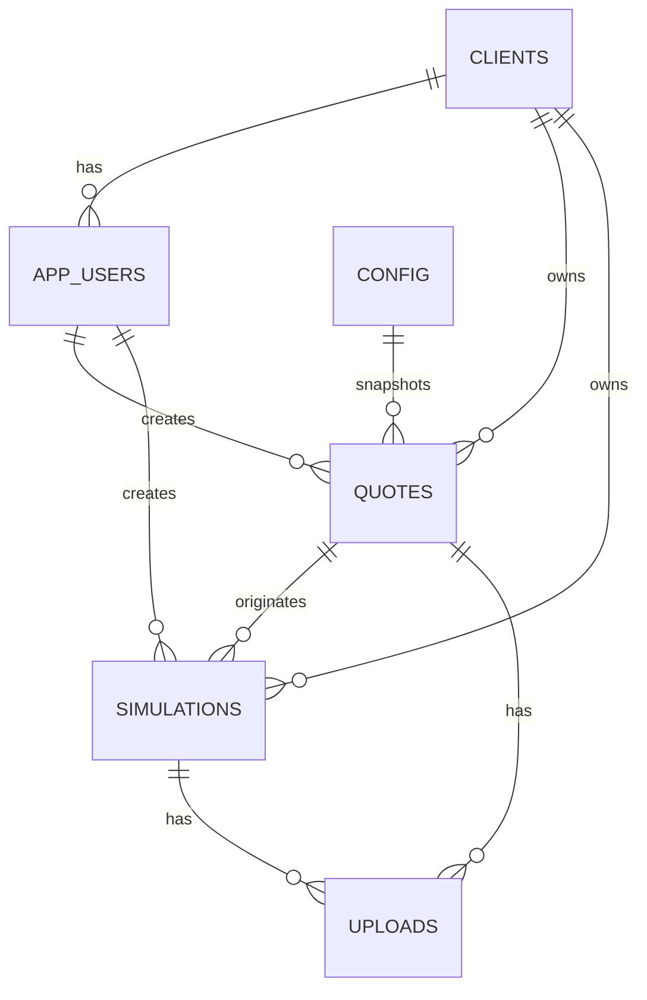

# Global RPX - Modelo de Banco

## Escopo

Este documento descreve o modelo atual implementado nas migrations e a direcao planejada. Para o estado vivo de entregas, consulte `state.md`.

Migrations atuais:

- `001_foundation.sql`
- `002_public_signup_profiles.sql`
- `003_app_users.sql`
- `004_admin_foundation.sql`
- `005_crud_soft_delete.sql`
- `006_client_quotes_persistence.sql`
- `20260709134047_create_uploads_table_and_storage_bucket.sql`
- `20260709180000_create_config_table.sql`

## Convencoes

- Banco: Supabase Postgres.
- IDs: `uuid` com `gen_random_uuid()`.
- Datas: `timestamptz`.
- Valores monetarios e taxas: `numeric`, nunca `float`.
- Dados de cliente devem ser vinculados por `client_id`.
- Registros operacionais usam `created_at`, `updated_at` e, quando aplicavel, usuario criador.
- Migrations ja aplicadas nao devem ser editadas; criar migrations incrementais.

## Relacionamentos Atuais



## Tabelas Atuais

### `clients`

Clientes/empresas da plataforma.

| Campo | Tipo | Regra atual |
|---|---|---|
| `id` | uuid | PK |
| `company_name` | text | opcional desde `005_crud_soft_delete.sql` |
| `trade_name` | text | opcional |
| `document` | text | opcional |
| `contact_name` | text | opcional |
| `contact_email` | text | opcional |
| `contact_phone` | text | opcional |
| `status` | text | `active`, `inactive` |
| `source` | text | `site`, `admin`; default `site` |
| `deleted_at` | timestamptz | soft delete |
| `created_at` | timestamptz | default `now()` |
| `updated_at` | timestamptz | default `now()` |

Uso atual:

- CRUD administrativo de Clientes.
- Vinculo com `app_users`.
- Vinculo com `quotes` e `simulations`.
- Soft delete/inativacao no admin.

### `app_users`

Fonte de verdade da aplicacao para usuario, role, status e vinculo com cliente.

| Campo | Tipo | Regra atual |
|---|---|---|
| `id` | uuid | PK |
| `name` | text | opcional |
| `email` | text | obrigatorio |
| `phone` | text | opcional |
| `role` | text | `admin`, `client` |
| `status` | text | `active`, `inactive` |
| `client_id` | uuid | FK `clients`, nulo para admin |
| `auth_provider` | text | ex.: `supabase` |
| `auth_provider_user_id` | text | id do usuario no provedor |
| `accepted_terms_at` | timestamptz | opcional |
| `deleted_at` | timestamptz | soft delete/inativacao |
| `created_at` | timestamptz | default `now()` |
| `updated_at` | timestamptz | default `now()` |

Indices relevantes:

- e-mail unico por `lower(email)` apenas quando `deleted_at is null`;
- combinacao unica de `auth_provider` e `auth_provider_user_id` quando ambos existem.

Regra:

- Novas implementacoes devem usar `app_users`, nao `profiles`, para perfil, role e status.

### `profiles` legado

Tabela criada na fundacao inicial como complemento de `auth.users`.

Status atual:

- Existe no banco por historico/migrations iniciais.
- Nao deve ser fonte principal da aplicacao.
- `003_app_users.sql` migrou a responsabilidade operacional para `app_users`.
- A funcao `is_admin()` atual consulta `app_users`.

### `quotes`

Cotacoes preliminares persistidas pela calculadora.

| Campo | Tipo | Regra atual |
|---|---|---|
| `id` | uuid | PK |
| `client_id` | uuid | FK `clients`, obrigatorio |
| `created_by_app_user_id` | uuid | FK `app_users`, opcional |
| `product_name` | text | obrigatorio |
| `hs_code` | text | NCM/HS sugerido |
| `supplier_name` | text | opcional |
| `supplier_email` | text | opcional |
| `supplier_phone` | text | opcional |
| `fob_unit_usd` | numeric(12,2) | |
| `quantity` | integer | |
| `fob_total_usd` | numeric(14,2) | |
| `used_dollar` | numeric(12,4) | taxa usada internamente |
| `rpx_factor` | numeric(10,4) | snapshot do fator RPX usado; origem atual `config.key = 'import_factor'` |
| `direct_import_factor` | numeric(10,4) | snapshot do fator importacao direta |
| `unit_cost_rpx_brl` | numeric(14,2) | |
| `total_cost_rpx_brl` | numeric(14,2) | |
| `unit_cost_direct_brl` | numeric(14,2) | |
| `total_cost_direct_brl` | numeric(14,2) | |
| `savings_brl` | numeric(14,2) | |
| `savings_percent` | numeric(10,4) | |
| `status` | text | ver status abaixo |
| `simulation_request_requested_at` | timestamptz | opcional |
| `product_image_urls` | text[] | fase atual para imagens do produto |
| `supplier_contact_image_urls` | text[] | fase atual para imagens de contato do fornecedor |
| `calculation_payload` | jsonb | snapshot do payload de calculo |
| `created_at` | timestamptz | default `now()` |
| `updated_at` | timestamptz | default `now()` |

Status atuais:

- `draft`
- `submitted`
- `simulation_requested`
- `in_review`
- `completed`

Observacao:

- `used_dollar` e snapshot da taxa interna usada na cotacao.
- `rpx_factor` e snapshot historico do fator RPX usado no calculo, salvo a partir de `config.import_factor`.
- `direct_import_factor` permanece snapshot independente e fora do escopo da configuracao dinamica atual.
- Os arrays `product_image_urls` e `supplier_contact_image_urls` permanecem como legado; o fluxo atual de upload usa `uploads`.

### `config`

Configuracoes globais da aplicacao.

| Campo | Tipo | Regra atual |
|---|---|---|
| `id` | uuid | PK |
| `key` | text | obrigatorio, unico, `^[a-z0-9_]+$` |
| `value` | text | obrigatorio |
| `description` | text | opcional |
| `created_at` | timestamptz | default `now()` |
| `updated_at` | timestamptz | trigger `set_updated_at()` |

Configuracao inicial:

| Key | Value | Uso |
|---|---|---|
| `import_factor` | `1.8` | fator RPX global usado no calculo de novas cotacoes |

Regras:

- `value` e texto para permitir configuracoes futuras.
- O codigo valida `import_factor` como numero decimal positivo.
- Admin pode listar, criar, editar e excluir configuracoes via RLS/admin actions.
- Cliente nao pode acessar a tabela diretamente.
- Alterar `import_factor` afeta novas cotacoes; cotacoes antigas preservam o snapshot em `quotes.rpx_factor`.

### `simulations`

Solicitacoes/simulacoes vinculadas a clientes e, quando aplicavel, cotacoes.

| Campo | Tipo | Regra atual |
|---|---|---|
| `id` | uuid | PK |
| `client_id` | uuid | FK `clients`, obrigatorio |
| `quote_id` | uuid | FK `quotes`, opcional |
| `created_by_app_user_id` | uuid | FK `app_users`, opcional |
| `title` | text | obrigatorio |
| `status` | text | ver status abaixo |
| `file_name` | text | opcional |
| `storage_path` | text | opcional |
| `quote_file_url` | text | opcional |
| `requested_at` | timestamptz | opcional |
| `client_notes` | text | opcional |
| `published_at` | timestamptz | opcional |
| `created_at` | timestamptz | default `now()` |
| `updated_at` | timestamptz | default `now()` |

Status atuais:

- `draft`
- `aguardando`
- `em_producao`
- `published`
- `finalizado`
- `cancelado`

Indice relevante:

- `simulations_pending_quote_idx` impede mais de uma simulacao pendente por `quote_id` nos status `aguardando`, `em_producao` ou `draft`.

Observacao:

- `file_name`, `storage_path` e `quote_file_url` permanecem como campos legados. A UI administrativa nova de detalhe da simulacao usa `uploads` e Supabase Storage privado.

### `uploads`

Metadados unificados de arquivos enviados para Supabase Storage.

| Campo | Tipo | Regra atual |
|---|---|---|
| `id` | uuid | PK |
| `bucket` | text | default `app-uploads` |
| `path` | text | caminho privado no Storage |
| `original_name` | text | nome enviado pelo usuario |
| `stored_name` | text | nome sanitizado usado no path |
| `mime_type` | text | opcional |
| `size_bytes` | bigint | tamanho do arquivo |
| `extension` | text | extensao normalizada |
| `context` | text | papel do arquivo, nao dono |
| `simulation_id` | uuid | FK `simulations`, opcional |
| `quote_id` | uuid | FK `quotes`, opcional |
| `uploaded_by` | uuid | FK `auth.users`, opcional |
| `created_at` | timestamptz | default `now()` |
| `updated_at` | timestamptz | trigger `set_updated_at()` |
| `deleted_at` | timestamptz | soft delete |

Regra de dono:

- CHECK `uploads_exactly_one_owner_check` exige exatamente um dono entre `simulation_id` e `quote_id`.
- Novos modulos devem adicionar uma FK opcional explicita, atualizar indices, CHECK e funcoes da aplicacao. Nao usar `owner_type`, `owner_id`, `entity_type` ou semelhantes.

Contextos iniciais:

- `simulation_result`
- `quote_product_images`
- `quote_supplier_contact`
- preparado na aplicacao para `quotation_attachment`, `supplier_invoice`, `product_photo`, `packing_list`, `invoice` e `technical_sheet`.

Indices relevantes:

- `uploads_bucket_path_idx` unico em `(bucket, path)`;
- `uploads_simulation_id_idx`;
- `uploads_quote_id_idx`;
- `uploads_context_idx`;
- `uploads_created_at_idx`;
- `uploads_deleted_at_idx`.

## RLS Atual

Funcoes/padroes:

- `is_admin()` usa `app_users`, `auth.uid()`, role `admin`, status `active`.
- Clientes autenticados leem dados vinculados ao proprio `client_id`.
- Admin le/altera registros operacionais conforme policies e actions server-side.
- Apenas admin acessa `config`; clientes nao possuem policy de leitura ou escrita.
- Clientes podem inserir/atualizar proprias cotacoes quando role/status permitem.
- Clientes podem inserir solicitacoes de simulacao proprias quando role/status permitem.

Cuidados:

- UI nao substitui RLS.
- `client_id` nao deve ser confiado a partir do browser.
- Actions administrativas devem validar permissao no servidor.

## Storage e Anexos

Estado atual:

- Bucket privado `app-uploads` configurado por migration com limite de 10MB.
- Tabela `uploads` guarda metadados e vinculo por FK real com `simulations` ou `quotes`.
- Leitura/download usa signed URL temporaria gerada server-side.
- Imagens da calculadora ainda usam arrays de URLs/texto em `quotes` ate migracao especifica do fluxo do cliente.

Paths atuais:

```text
simulations/{simulation_id}/{upload_id}/{safe_filename}
quotes/{quote_id}/{upload_id}/{safe_filename}
quotes/{quote_id}/product-images/{upload_id}/{safe_filename}
quotes/{quote_id}/supplier-contact/{upload_id}/{safe_filename}
```

Bucket:

```text
app-uploads
```

O bucket e privado. Policies em `storage.objects` permitem acesso somente a usuarios admin autenticados nesta fase.

## Modelo Planejado Ainda Nao Implementado

As tabelas abaixo aparecem em specs/planos como evolucao, mas nao devem ser tratadas como implementadas no estado atual:

- `suppliers`
- `products`
- `ncm_codes`
- `tax_rules`
- `quote_calculations` separada
- `quote_attachments` ou `quote_images`
- `quote_status_history`
- `calculation_parameters`
- `simulation_versions`

Quando forem implementadas, criar migration incremental, atualizar este documento e validar RLS.

## Exemplos Conceituais

Cotacao:

```json
{
  "product_name": "Garrafa termica inox",
  "hs_code": "9617.00.10",
  "fob_unit_usd": 12,
  "quantity": 1000,
  "status": "submitted"
}
```

Solicitacao de simulacao:

```json
{
  "quote_id": "uuid-da-cotacao",
  "status": "aguardando",
  "title": "Simulacao completa - Garrafa termica inox"
}
```
