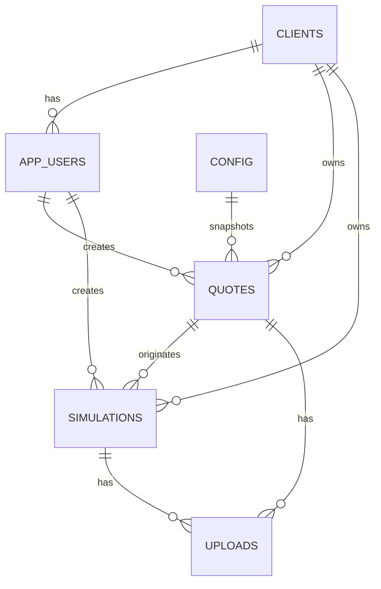

# Global RPX - Modelo de Banco

## Escopo

Este documento descreve o modelo atual implementado nas migrations e a direcao planejada. Para o estado vivo de entregas, consulte `state.md`.

Migrations atuais:

- `001_foundation.sql`
- `002_public_signup_profiles.sql`
- `003_app_users.sql`
- `004_admin_foundation.sql`
- `005_crud_soft_delete.sql`
- `006_client_quotes_persistence.sql`
- `20260709134047_create_uploads_table_and_storage_bucket.sql`
- `20260709180000_create_config_table.sql`
- `20260709200000_create_final_simulations_core.sql`
- `20260709213000_create_expense_types_and_presets.sql`
- `20260710120000_create_invoice_parametrizations.sql`

## Convencoes

- Banco: Supabase Postgres.
- IDs: `uuid` com `gen_random_uuid()`.
- Datas: `timestamptz`.
- Valores monetarios e taxas: `numeric`, nunca `float`.
- Dados de cliente devem ser vinculados por `client_id`.
- Registros operacionais usam `created_at`, `updated_at` e, quando aplicavel, usuario criador.
- Migrations ja aplicadas nao devem ser editadas; criar migrations incrementais.

## Relacionamentos Atuais



## Tabelas Atuais

### `clients`

Clientes/empresas da plataforma.

| Campo | Tipo | Regra atual |
|---|---|---|
| `id` | uuid | PK |
| `company_name` | text | opcional desde `005_crud_soft_delete.sql` |
| `trade_name` | text | opcional |
| `document` | text | opcional |
| `contact_name` | text | opcional |
| `contact_email` | text | opcional |
| `contact_phone` | text | opcional |
| `status` | text | `active`, `inactive` |
| `source` | text | `site`, `admin`; default `site` |
| `deleted_at` | timestamptz | soft delete |
| `created_at` | timestamptz | default `now()` |
| `updated_at` | timestamptz | default `now()` |

Uso atual:

- CRUD administrativo de Clientes.
- Vinculo com `app_users`.
- Vinculo com `quotes` e `simulations`.
- Soft delete/inativacao no admin.

### `app_users`

Fonte de verdade da aplicacao para usuario, role, status e vinculo com cliente.

| Campo | Tipo | Regra atual |
|---|---|---|
| `id` | uuid | PK |
| `name` | text | opcional |
| `email` | text | obrigatorio |
| `phone` | text | opcional |
| `role` | text | `admin`, `client` |
| `status` | text | `active`, `inactive` |
| `client_id` | uuid | FK `clients`, nulo para admin |
| `auth_provider` | text | ex.: `supabase` |
| `auth_provider_user_id` | text | id do usuario no provedor |
| `accepted_terms_at` | timestamptz | opcional |
| `deleted_at` | timestamptz | soft delete/inativacao |
| `created_at` | timestamptz | default `now()` |
| `updated_at` | timestamptz | default `now()` |

Indices relevantes:

- e-mail unico por `lower(email)` apenas quando `deleted_at is null`;
- combinacao unica de `auth_provider` e `auth_provider_user_id` quando ambos existem.

Regra:

- Novas implementacoes devem usar `app_users`, nao `profiles`, para perfil, role e status.

### `profiles` legado

Tabela criada na fundacao inicial como complemento de `auth.users`.

Status atual:

- Existe no banco por historico/migrations iniciais.
- Nao deve ser fonte principal da aplicacao.
- `003_app_users.sql` migrou a responsabilidade operacional para `app_users`.
- A funcao `is_admin()` atual consulta `app_users`.

### `quotes`

Cotacoes preliminares persistidas pela calculadora.

| Campo | Tipo | Regra atual |
|---|---|---|
| `id` | uuid | PK |
| `client_id` | uuid | FK `clients`, obrigatorio |
| `created_by_app_user_id` | uuid | FK `app_users`, opcional |
| `product_name` | text | obrigatorio |
| `hs_code` | text | NCM/HS sugerido |
| `supplier_name` | text | opcional |
| `supplier_email` | text | opcional |
| `supplier_phone` | text | opcional |
| `fob_unit_usd` | numeric(12,2) | |
| `quantity` | integer | |
| `fob_total_usd` | numeric(14,2) | |
| `used_dollar` | numeric(12,4) | taxa usada internamente |
| `rpx_factor` | numeric(10,4) | snapshot do fator RPX usado; origem atual `config.key = 'import_factor'` |
| `direct_import_factor` | numeric(10,4) | snapshot do fator importacao direta |
| `unit_cost_rpx_brl` | numeric(14,2) | |
| `total_cost_rpx_brl` | numeric(14,2) | |
| `unit_cost_direct_brl` | numeric(14,2) | |
| `total_cost_direct_brl` | numeric(14,2) | |
| `savings_brl` | numeric(14,2) | |
| `savings_percent` | numeric(10,4) | |
| `status` | text | ver status abaixo |
| `simulation_request_requested_at` | timestamptz | opcional |
| `product_image_urls` | text[] | fase atual para imagens do produto |
| `supplier_contact_image_urls` | text[] | fase atual para imagens de contato do fornecedor |
| `calculation_payload` | jsonb | snapshot do payload de calculo |
| `created_at` | timestamptz | default `now()` |
| `updated_at` | timestamptz | default `now()` |

Status atuais:

- `draft`
- `submitted`
- `simulation_requested`
- `in_review`
- `completed`

Observacao:

- `used_dollar` e snapshot da taxa interna usada na cotacao.
- `rpx_factor` e snapshot historico do fator RPX usado no calculo, salvo a partir de `config.import_factor`.
- `direct_import_factor` permanece snapshot independente e fora do escopo da configuracao dinamica atual.
- Os arrays `product_image_urls` e `supplier_contact_image_urls` permanecem como legado; o fluxo atual de upload usa `uploads`.

### `config`

Configuracoes globais da aplicacao.

| Campo | Tipo | Regra atual |
|---|---|---|
| `id` | uuid | PK |
| `key` | text | obrigatorio, unico, `^[a-z0-9_]+$` |
| `value` | text | obrigatorio |
| `description` | text | opcional |
| `created_at` | timestamptz | default `now()` |
| `updated_at` | timestamptz | trigger `set_updated_at()` |

Configuracao inicial:

| Key | Value | Uso |
|---|---|---|
| `import_factor` | `1.8` | fator RPX global usado no calculo de novas cotacoes |

Regras:

- `value` e texto para permitir configuracoes futuras.
- O codigo valida `import_factor` como numero decimal positivo.
- Admin pode listar, criar, editar e excluir configuracoes via RLS/admin actions.
- Cliente nao pode acessar a tabela diretamente.
- Alterar `import_factor` afeta novas cotacoes; cotacoes antigas preservam o snapshot em `quotes.rpx_factor`.

### `simulations`

Solicitacoes/simulacoes vinculadas a clientes e, quando aplicavel, cotacoes.

| Campo | Tipo | Regra atual |
|---|---|---|
| `id` | uuid | PK |
| `client_id` | uuid | FK `clients`, obrigatorio |
| `quote_id` | uuid | FK `quotes`, opcional |
| `created_by_app_user_id` | uuid | FK `app_users`, opcional |
| `title` | text | obrigatorio |
| `status` | text | ver status abaixo |
| `file_name` | text | opcional |
| `storage_path` | text | opcional |
| `quote_file_url` | text | opcional |
| `requested_at` | timestamptz | opcional |
| `client_notes` | text | opcional |
| `published_at` | timestamptz | opcional |
| `created_at` | timestamptz | default `now()` |
| `updated_at` | timestamptz | default `now()` |

Status atuais:

- `draft`
- `aguardando`
- `em_producao`
- `published`
- `finalizado`
- `cancelado`

Indice relevante:

- `simulations_pending_quote_idx` impede mais de uma simulacao pendente por `quote_id` nos status `aguardando`, `em_producao` ou `draft`.

Observacao:

- `file_name`, `storage_path` e `quote_file_url` permanecem como campos legados. A UI administrativa nova de detalhe da simulacao usa `uploads` e Supabase Storage privado.

### `uploads`

Metadados unificados de arquivos enviados para Supabase Storage.

| Campo | Tipo | Regra atual |
|---|---|---|
| `id` | uuid | PK |
| `bucket` | text | default `app-uploads` |
| `path` | text | caminho privado no Storage |
| `original_name` | text | nome enviado pelo usuario |
| `stored_name` | text | nome sanitizado usado no path |
| `mime_type` | text | opcional |
| `size_bytes` | bigint | tamanho do arquivo |
| `extension` | text | extensao normalizada |
| `context` | text | papel do arquivo, nao dono |
| `simulation_id` | uuid | FK `simulations`, opcional |
| `quote_id` | uuid | FK `quotes`, opcional |
| `uploaded_by` | uuid | FK `auth.users`, opcional |
| `created_at` | timestamptz | default `now()` |
| `updated_at` | timestamptz | trigger `set_updated_at()` |
| `deleted_at` | timestamptz | soft delete |

Regra de dono:

- CHECK `uploads_exactly_one_owner_check` exige exatamente um dono entre `simulation_id` e `quote_id`.
- Novos modulos devem adicionar uma FK opcional explicita, atualizar indices, CHECK e funcoes da aplicacao. Nao usar `owner_type`, `owner_id`, `entity_type` ou semelhantes.

Contextos iniciais:

- `simulation_result`
- `quote_product_images`
- `quote_supplier_contact`
- preparado na aplicacao para `quotation_attachment`, `supplier_invoice`, `product_photo`, `packing_list`, `invoice` e `technical_sheet`.

Indices relevantes:

- `uploads_bucket_path_idx` unico em `(bucket, path)`;
- `uploads_simulation_id_idx`;
- `uploads_quote_id_idx`;
- `uploads_context_idx`;
- `uploads_created_at_idx`;
- `uploads_deleted_at_idx`.

## RLS Atual

Funcoes/padroes:

- `is_admin()` usa `app_users`, `auth.uid()`, role `admin`, status `active`.
- Clientes autenticados leem dados vinculados ao proprio `client_id`.
- Admin le/altera registros operacionais conforme policies e actions server-side.
- Apenas admin acessa `config`; clientes nao possuem policy de leitura ou escrita.
- Clientes podem inserir/atualizar proprias cotacoes quando role/status permitem.
- Clientes podem inserir solicitacoes de simulacao proprias quando role/status permitem.

Cuidados:

- UI nao substitui RLS.
- `client_id` nao deve ser confiado a partir do browser.
- Actions administrativas devem validar permissao no servidor.

## Storage e Anexos

Estado atual:

- Bucket privado `app-uploads` configurado por migration com limite de 10MB.
- Tabela `uploads` guarda metadados e vinculo por FK real com `simulations` ou `quotes`.
- Leitura/download usa signed URL temporaria gerada server-side.
- Imagens da calculadora ainda usam arrays de URLs/texto em `quotes` ate migracao especifica do fluxo do cliente.

Paths atuais:

```text
simulations/{simulation_id}/{upload_id}/{safe_filename}
quotes/{quote_id}/{upload_id}/{safe_filename}
quotes/{quote_id}/product-images/{upload_id}/{safe_filename}
quotes/{quote_id}/supplier-contact/{upload_id}/{safe_filename}
```

Bucket:

```text
app-uploads
```

O bucket e privado. Policies em `storage.objects` permitem acesso somente a usuarios admin autenticados nesta fase.

## Simulacoes Finais - Nucleo Estrutural

A migration `20260709200000_create_final_simulations_core.sql` cria a base estrutural do modulo futuro de Simulacoes Finais.

Escopo desta migration:

- modelo de dados inicial;
- constraints/checks principais;
- indices de acesso;
- triggers de `updated_at` onde aplicavel;
- RLS habilitado;
- policies conservadoras somente para admins;
- seed dos 27 estados brasileiros.

Fora do escopo desta migration:

- UI;
- Server Actions;
- calculo fiscal completo;
- bucket novo;
- alteracao da tabela `uploads`;
- policies de cliente;
- aplicacao de migrations de `temp/`.

### `final_simulations`

Entidade principal do novo modulo de Simulacoes Finais. Nao substitui a tabela atual `simulations`.

Campos principais:

- identificacao: `id`, `code`, `number`;
- status: `draft`, `in_review`, `needs_adjustment`, `approved`, `sent_to_customer`, `archived`;
- cliente: `customer_id` FK opcional para `clients`, `customer_name` snapshot textual;
- fornecedor/filial: `supplier_id` e `branch_id` como `uuid` sem FK nesta migration, com snapshots textuais;
- usuarios: `created_by`, `updated_by`, `assigned_to`, `approved_by`, `reopened_by`, todos referenciando `app_users`;
- dados da operacao: data, validade, modalidade, transporte, origem/destino, embalagem, licenca e observacoes;
- valores e pesos: moeda, cambio, frete, seguro, valor aduaneiro, impostos, despesas, custo total, pesos, volume e containers;
- parametrizacao fiscal: comissao da trade, flags de creditos tributarios, snapshot de regime fiscal e parametrizacoes de NF de entrada/saida;
- snapshots: `calculation_snapshot`, `public_snapshot`, `internal_snapshot`.

Uso atual dos snapshots de documentos:

- `calculation_snapshot`: resultado salvo do recálculo fiscal V1, usado como fonte para preview e documentos.
- `public_snapshot`: base congelada do PDF cliente, contendo apenas dados publicáveis, disclaimers, warnings públicos e metadados de geração.
- `internal_snapshot`: base congelada do relatório interno, contendo dados detalhados da simulação, produtos, despesas, linhas fiscais, snapshots fiscais, cálculo salvo, warnings e limitações V1.

Metadados mínimos dos snapshots de documentos:

- `snapshot_version`;
- `snapshot_type`;
- `generated_at`;
- `generated_by`;
- `source_simulation_id`;
- `source_calculation_calculated_at`.

Checks:

- status fechado na lista aprovada da V1;
- `import_modality`: `propria`, `conta_e_ordem`, `encomenda`;
- `transport_mode`: `maritimo`, `aereo`, `rodoviario`;
- `currency` curto, com ate 3 caracteres quando preenchido.
- `trade_commission_mode`, quando preenchido: `percent`, `fixed_expense`, `none`.

### `final_simulation_items`

Itens/produtos vinculados a `final_simulations`.

Conteudo:

- descricao de produto;
- HS/NCM;
- snapshot de NCM e aliquotas;
- validacao RPX de NCM;
- pesos, quantidades, FOB/CIF, custos e totais;
- antidumping, regime especial e snapshots;
- campos futuros para pedido de compra sem FK nesta etapa.

### `simulation_tax_lines`

Linhas de impostos calculados ou ajustados para simulacao e, opcionalmente, item.

`tax_type` aceito:

- `II`
- `IPI`
- `PIS_IMPORTACAO`
- `COFINS_IMPORTACAO`
- `ICMS`
- `AFRMM`
- `ANTIDUMPING`
- `OUTROS`

### `simulation_expense_lines`

Linhas de despesas vinculadas a simulacao e, opcionalmente, item.

Nesta migration, `source_preset_id`, `source_preset_item_id` e `expense_type_id` ficam como `uuid` sem FK porque os cadastros de tipos, presets e itens de preset serao criados em migrations posteriores.

### `simulation_versions`

Snapshots/versionamento da Simulacao Final.

Regra:

- `unique(simulation_id, version_number)`.

### `simulation_documents`

Metadados de documentos gerados.

Campos de relacionamento:

- `simulation_id` FK para `final_simulations`;
- `version_id` FK opcional para `simulation_versions`;
- `upload_id` FK opcional para `uploads`.

`document_type` aceito:

- `client_pdf`
- `internal_detailed_report`
- `pricing_excel`

Observacao: `pricing_excel` fica preparado no modelo, mas a funcionalidade esta fora da V1 operacional.

Pendencia conhecida: como `uploads` ainda exige dono entre `simulation_id` e `quote_id`, uma migration posterior deve avaliar `uploads.final_simulation_id` e ajuste do CHECK antes de usar `uploads` como dono direto de documentos de Simulacao Final.

### Lacunas para PDF cliente e relatorio interno

O mapeamento em `docs/FINAL_SIMULATION_OUTPUT_MAPPING.md` comparou o PDF/planilha real `MOBITA CAPACETE` com o modelo atual.

Campos/decisoes ainda pendentes antes da geracao fiel do PDF cliente:

- regra oficial de numero sequencial e revisao da simulacao;
- snapshot final publico (`public_snapshot`) e interno (`internal_snapshot`) com estrutura fechada para documentos;
- formula oficial de CIF, base aduaneira, base ICMS, NF entrada, NF saida e custo unitario;
- rateio de despesas por item e separacao de despesas publicas vs. internas;
- modelagem ou snapshot para carga IMO, credito presumido, ICMS ST, IPI NF, honorarios, imposto sobre faturamento e desembolso total USD;
- observacoes comerciais/disclaimers publicos separados de notas internas;
- avaliacao futura de `uploads.final_simulation_id` para documentos gerados do modulo.

### `states`

Cadastro local de UFs brasileiras.

A migration insere os 27 estados brasileiros com `is_active = true`, usando `uf` como chave unica.

### `ncm_codes`

Base local de NCM para busca, snapshot e validacao RPX.

Campos principais:

- `code`;
- `description`;
- `hierarchical_description`;
- `legal_act`;
- fonte e data de atualizacao;
- status ativo.

### `ncm_tax_profiles`

Perfis tributarios locais por NCM.

Conteudo:

- NCM referenciado por `ncm_code`;
- pais, tipo de operacao e vigencia;
- aliquotas de II, IPI, PIS, COFINS e ICMS;
- snapshots de antidumping, ex-tarifario e base legal.

## Simulacoes Finais - Tipos de Despesa e Pre-calculos

A migration `20260709213000_create_expense_types_and_presets.sql` cria os cadastros mestres de despesas para etapas futuras do modulo de Simulacoes Finais.

Escopo desta migration:

- `expense_types`;
- `expense_presets`;
- `expense_preset_items`;
- constraints/checks principais;
- indices de acesso;
- triggers de `updated_at`;
- RLS habilitado;
- policies conservadoras somente para admins.

Fora do escopo desta migration:

- UI de despesas;
- processamento de pre-calculo dentro da simulacao;
- `invoice_parametrizations`;
- `simulation_encomenda_taxes`;
- calculo fiscal final;
- PDF;
- seeds de tipos ou presets;
- policies de cliente;
- bucket novo;
- alteracoes em `uploads`.

### `expense_types`

Cadastro mestre de tipos de despesa e bases de calculo usados futuramente em despesas/pre-calculos da Simulacao Final.

Campos principais:

- identificacao: `id`, `code`, `description`, `key`, `print_order`;
- classificacao: `expense_modality`, `allocation_type`, `expense_calculation_type` e respectivos labels;
- comportamento por modalidade: `own_import_behavior`, `order_account_behavior`, `encomenda_behavior` e respectivos labels;
- operacao/fiscal: `expense_resulting`, `siscomex_addition_id`, `expense_group_id`, `expense_group_name`, flags de container, ICMS de entrada e nota de servico;
- financeiro/ERP opcional: tipo de titulo, servico, conta bancaria e `erp_key`;
- numerario: flags `paid_by_cash_*`;
- controle: `is_active`, `created_by`, `updated_by`, `created_at`, `updated_at`.

Checks:

- `expense_modality`: `tax`, `expense`, `calculation_base`;
- `allocation_type`: `value`, `net_weight`, `cif`, `gross_weight`;
- `expense_calculation_type`: `parameters`, `fob`, `freight`, `insurance`, `cif`, `ii`, `ipi`, `icms`;
- comportamentos por modalidade: `accessory_expense`, `tax_base`, `icms_base`, `not_applicable`, `product_cost_only`, `icms_base_courier_fine`, `ipi_base`.

### `expense_presets`

Cadastro de pre-calculos/presets de despesas por via de transporte.

Campos principais:

- `name`;
- `description`;
- `transport_mode`;
- `is_active`;
- `created_by`, `updated_by`, `created_at`, `updated_at`.

Check:

- `transport_mode`: `maritimo`, `aereo`, `rodoviario`.

### `expense_preset_items`

Itens que compoem um preset de despesas.

Campos principais:

- `preset_id` FK para `expense_presets`;
- `expense_type_id` FK para `expense_types`;
- snapshots de codigo/descricao do tipo de despesa;
- valores padrao em BRL/USD e moeda;
- overrides opcionais de tipo de calculo, rateio e comportamento;
- `is_editable`, `sort_order`, `notes`;
- `created_by`, `updated_by`, `created_at`, `updated_at`.

Checks:

- `default_currency` nulo ou curto, com ate 3 caracteres;
- `override_calculation_type`, quando preenchido, segue os valores de `expense_calculation_type`;
- `override_allocation_type`, quando preenchido, segue os valores de `allocation_type`;
- `override_behavior`, quando preenchido, segue os valores dos comportamentos por modalidade.

## Simulacoes Finais - Parametrizacao Fiscal

A migration `20260710120000_create_invoice_parametrizations.sql` cria a base de parametrizacao fiscal para notas fiscais de entrada/saida e adiciona snapshots fiscais na Simulacao Final.

Escopo desta migration:

- tabela `invoice_parametrizations`;
- campos de comissao da trade em `final_simulations`;
- flags de creditos tributarios em `final_simulations`;
- snapshots fiscais e de parametrizacao de NF em `final_simulations`;
- constraints/checks principais;
- indices de acesso;
- trigger de `updated_at` em `invoice_parametrizations`;
- RLS habilitado em `invoice_parametrizations`;
- policies conservadoras somente para admins.

Fora do escopo desta migration:

- UI de parametrizacao fiscal;
- actions/queries/types;
- calculo fiscal final;
- aplicacao da comissao da trade;
- interpretacao de creditos tributarios no custo final;
- PDF;
- policies de cliente;
- alteracoes em auth, uploads ou storage.

### `invoice_parametrizations`

Cadastro mestre de parametrizacoes fiscais para NF de entrada e NF de saida.

Campos principais:

- identificacao: `id`, `code`, `key`, `description`;
- tipo: `operation_type` (`entrada` ou `saida`);
- natureza/operacao: `operation_nature`, `cfop`, `operation_group`;
- regime e destino: `tax_regime`, `destination_scope`, `customer_profile`;
- aliquota base: `icms_rate`;
- unificacao: `is_unified`;
- escopo opcional: `branch_id`, `branch_name`, `customer_id`, `customer_name`;
- controle: `is_active`, `internal_notes`, `created_by`, `updated_by`, `created_at`, `updated_at`.

Checks:

- `operation_type`: `entrada`, `saida`;
- `operation_group`, quando preenchido: `conta_e_ordem`, `venda_mercadoria`, `unificado`, `compra_comercializacao`, `simulacao_terceiros`, `outro`;
- `tax_regime`, quando preenchido: `simples_nacional`, `lucro_real`, `lucro_presumido`, `consumidor_final`, `outro`;
- `destination_scope`, quando preenchido: `interno`, `interestadual`, `fora_estado`, `outro`;
- `customer_profile`, quando preenchido: `revenda`, `consumidor_final`, `industria`, `outro`.

### Campos fiscais em `final_simulations`

Campos adicionados:

- comissao trade: `trade_commission_mode`, `trade_commission_percent`, `trade_commission_amount_brl`, `ignore_trade_commission_contract`;
- creditos: `credits_ipi`, `credits_pis`, `credits_cofins`, `credits_icms`;
- snapshot fiscal: `tax_regime_snapshot`, `tax_credit_notes`, `tax_credit_validated_by`, `tax_credit_validated_at`;
- NF entrada: `entry_invoice_parametrization_id`, `entry_invoice_parametrization_snapshot`;
- NF saida: `exit_invoice_parametrization_id`, `exit_invoice_parametrization_snapshot`.

Regra:

- Os campos preparam o armazenamento da parametrizacao e dos snapshots.
- A migration nao implementa calculo, UI, validacao operacional da equipe RPX nem exposicao ao cliente.

## RLS de Simulacoes Finais

Todas as tabelas novas das migrations de Simulacoes Finais possuem RLS habilitado.

Policies criadas nesta etapa:

- admins podem ler, inserir, atualizar e deletar registros das novas tabelas;
- a verificacao usa `public.is_admin()`, que consulta `app_users`;
- nenhuma policy baseada em `profiles` foi criada;
- nenhuma policy de cliente foi criada nesta migration.

Policies de cliente para Simulacoes Finais devem ser criadas somente quando houver contrato de area cliente, DTO publico, snapshot publico e regra de publicacao definidos.

## Modelo Planejado Ainda Nao Implementado

As tabelas abaixo aparecem em specs/planos como evolucao, mas nao devem ser tratadas como implementadas no estado atual:

- `suppliers`
- `products`
- `tax_rules`
- `quote_calculations` separada
- `quote_attachments` ou `quote_images`
- `quote_status_history`
- `calculation_parameters`
- `invoice_parametrizations`
- `simulation_encomenda_taxes`

Quando forem implementadas, criar migration incremental, atualizar este documento e validar RLS.

## Exemplos Conceituais

Cotacao:

```json
{
  "product_name": "Garrafa termica inox",
  "hs_code": "9617.00.10",
  "fob_unit_usd": 12,
  "quantity": 1000,
  "status": "submitted"
}
```

Solicitacao de simulacao:

```json
{
  "quote_id": "uuid-da-cotacao",
  "status": "aguardando",
  "title": "Simulacao completa - Garrafa termica inox"
}
```
